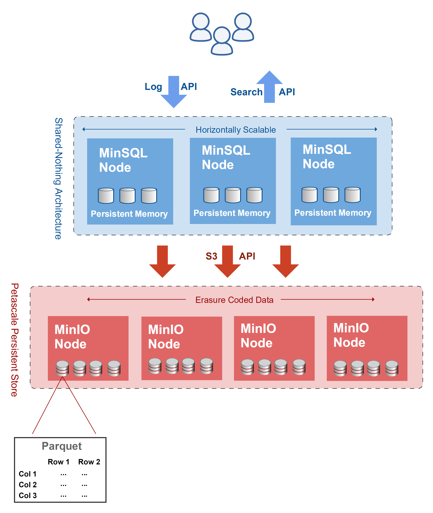

# MinSQL

Massively parallel log search engine with a simple HTTP API. For usage instructions, click [here](#Usage).

MinSQL ingests and searches petabytes of data distributed across MinIO buckets. MinSQL relies on the high speed data access capabilities of MinIO Object Storage and effieciency of the parquet data format to achieve massive scale.

Each data unit in MinSQL is a JSON document. There are no restrictions on the schema of these documents.

## Features

- [x] Petascale
- [x] Ingest
- [x] Search
- [x] Shared Nothing

## Architecture



# Usage

## Install
```sh
go get github.com/minio/minsql
minsql -h
```

## Run
```
export MINIO_ENDPOINT=https://play.minio.io:9000
export MINIO_ACCESS_KEY=Q3AM3UQ867SPQQA43P2F
export MINIO_SECRET_KEY=zuf+tfteSlswRu7BJ86wekitnifILbZam1KYY3TG
minsql
2019/03/04 10:02:49 MinSQL now listening on :9999
```

## Create a datastore
Following example save it as `config.toml`
```toml
version = 1

[datastore]
    [datastore.play]
    endpoint = "https://play.minio.io:9000"
    access_key = "Q3AM3UQ867SPQQA43P2F"
    secret_key = "zuf+tfteSlswRu7BJ86wekitnifILbZam1KYY3TG"
    bucket = "testbucket1"
    prefix = ""

    [datastore.myminio]
    endpoint = "https://play.minio.io:9000"
    access_key = "Q3AM3UQ867SPQQA43P2F"
    secret_key = "zuf+tfteSlswRu7BJ86wekitnifILbZam1KYY3TG"
    bucket = "testbucket2"
    prefix = ""

[table]
    [table.temperature1]
    datastores = ["play", "myminio"]

[auth]
    [auth.NAME1]
        [auth.NAME1.temperature1]
        token = "TOKEN1"
        api = ["search"]
        expire = "duration"
        status = "enabled"
    [auth.NAME2]
        [auth.NAME2.temperature2]
        token = "TOKEN2"
        api = ["search", "log"]
        expire = "duration"
        status = "disabled"
```

Upload the new config
```
mc cp config.toml play/config/config.toml
```

> NOTE: There is no need to restart the MinSQL server, config will be reloaded automatically.

## Search API
```
curl http://minsql:9999/search --data 'select s.key from tablename s where s.size > 1000'
```

## Log API
```
curl http://minsql:9999/log/tablename --data @log.json
```
